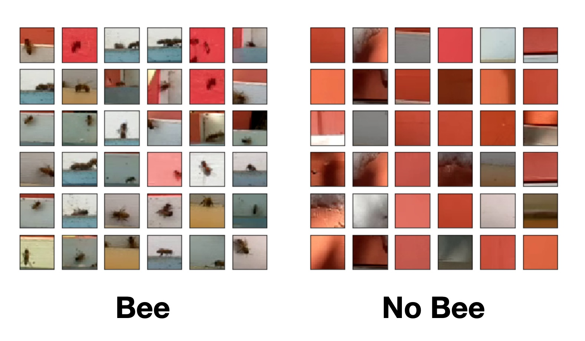

<div class="message">
Counting the number of <b>foragers</b> (bees that collect pollen, nectar, and water) is an important measure of hive health. What if we could use a <b>convolutional neural network</b> to count bees at the entrance of the hive?
</div>

Luckily, we can stand on the shoulders of giants. In [this great paper](https://www.mdpi.com/2076-3417/9/18/3743) by Vladimir Kulyukin and Sarbajit Mukherjee, the authors trained a CNN classifier for this very purpose.  **And they released their labeled data!**

Let's take a look at some of that sweet, sweet data (from dataset BEE1, 32x32 images):



The "no bee" class seems to have a red bias, but we'll address that later.  

Here's the architecture that they say worked best for a 32x32 input image:


With that image, I was able to implement the network in a few minutes using  Keras:

```python
model = models.Sequential()

model.add(layers.Conv2D(64, (3, 3), activation='relu', input_shape=(32, 32, 3)))
model.add(layers.MaxPooling2D((2, 2)))
model.add(layers.BatchNormalization())

model.add(layers.Conv2D(128, (3, 3), activation='relu'))
model.add(layers.MaxPooling2D((2, 2)))
model.add(layers.BatchNormalization())

model.add(layers.Conv2D(256, (3, 3), activation='relu'))
model.add(layers.MaxPooling2D((2, 2)))

model.add(layers.Flatten())

model.add(layers.Dense(512))
model.add(layers.Dropout(0.5))
model.add(layers.Activation("relu"))

model.add(layers.Dense(256))
model.add(layers.Dropout(0.5))
model.add(layers.Activation("relu"))

model.add(layers.Dense(128))
model.add(layers.Dropout(0.5))
model.add(layers.Activation("relu"))

model.add(layers.Dense(64))
model.add(layers.Dropout(0.5))
model.add(layers.Activation("relu"))

model.add(layers.Dense(1))
model.add(layers.Activation("sigmoid"))
```

Here's what the accuracy looks like during training:


### Applying It To Our Data

Note that this is an image **classifier**, not a detector.  To apply this classifier to video, the authors used a scheme like this:

1. apply some background subtraction/motion detection algorithm like [MOG](http://www.ee.surrey.ac.uk/CVSSP/Publications/papers/KaewTraKulPong-AVBS01.pdf), [MOG2](https://ieeexplore.ieee.org/document/1333992), or [GMG](https://goldberg.berkeley.edu/pubs/acc-2012-visual-tracking-final.pdf) to determine regions of interest, then
2. generate some 32x32 image tile containing the region of interest, then
3. run the CNN on the tile to determine whether the motion was "bee related" or not

In other words, **rather than counting the number of bees, they are counting the number of movements that are bee-related**.  This is a useful metric to determine *relative* changes in foraging behavior.  That said, a bee detection or pose estimation NN may provide even more insight.   

Regardless, this should be pretty easy to implement.  Let's revisit the video of a hive entrance I analyzed in an [earlier post](quick-video-analysis.html):


Here's the video with the [MOG2](https://docs.opencv.org/master/d1/dc5/tutorial_background_subtraction.html) background subtraction algorithm applied:


We can then threshold the background subtraction output to get regions with substantial movement only:


