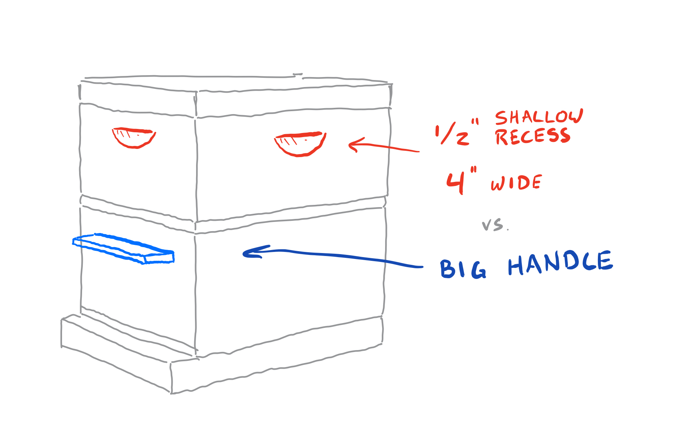

Last year I made some hive boxes. I just measured the dimensions from store-bought ones and duplicated them. 

Commercially-available hives tend to include a recessed handle for your convenience. Sometimes they'll throw in a couple of 3/4" sticks as a bonus. These handles are garbage. 

Consider the following: A fully-loaded deep super can weigh up to 70 pounds. In gloved hands, that half-inch finger grip isn't gonna cut it.  That's why you need a dowel-reinforced big handle. 

 
