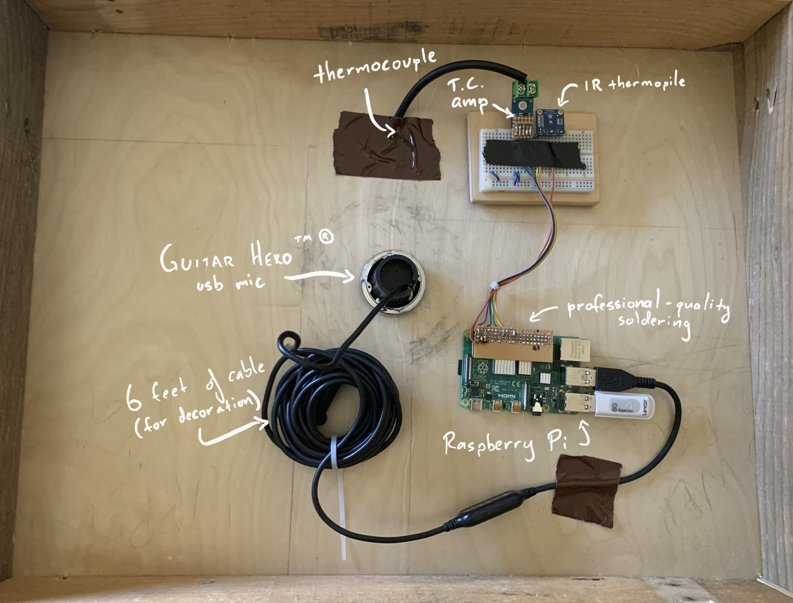
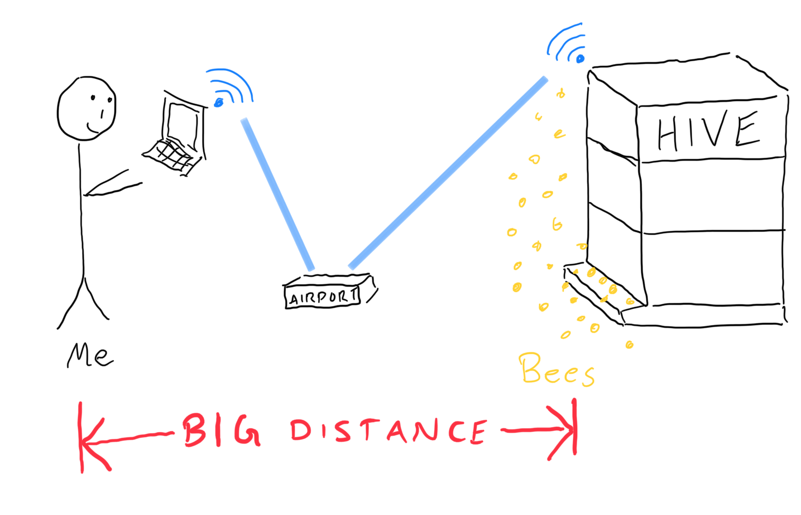
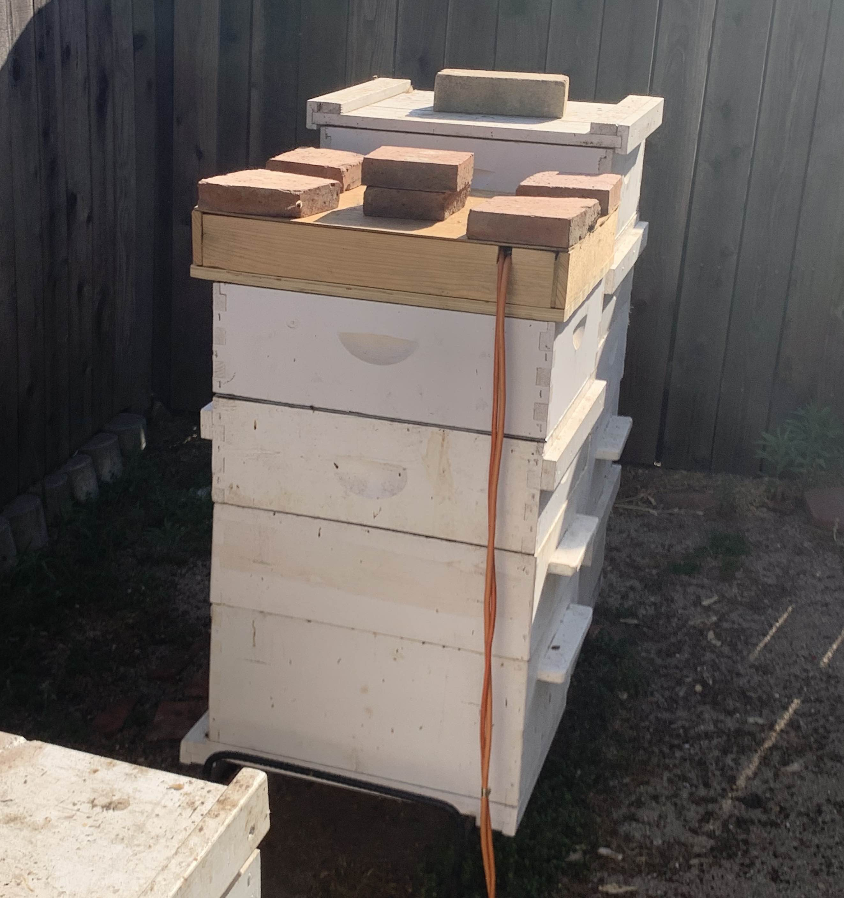

Here's a prototype I'm working on for monitoring a hive's temperature and audio.  The brains of the operation is a Raspberry Pi 4 running Raspbian.  Here's what it looks like on the inside:



### Temperature Data Collection

I'm measuring hive temperature with two sensors:

* k-type thermocouple and amplifier (MAX6675) for internal temperature
* infrared thermopile (TMP006) for ambient temperature

Ideally I'd use just thermocouples, but these are the only sensors I have on hand. [Here's an analysis of the temperature data I collected from this setup](hive-temp.html).

I'm using a [python library](https://github.com/tdack/MAX6675) to read the temperature every ten seconds.  The logging scheme is decidedly un-fancy -- I'm just appending a text file with timestamped readings.  Here's the basic idea:

```python
while True:
    with open("temp.txt", "a") as f:
        dat = datetime.datetime.now()
        t1, t2, t3 = 0, 0, 0
        try:
            t1 = sensor1.readTempC()
            t2 = sensor2.readDieTempC()
            t3 = sensor2.readObjTempC()
        except:
            print "An error occured"
        f.write(','.join([dat, t1, t2, t3]) + "\n")
        time.sleep(10.0)
```

Initially, I wrote the script with the `open` statement outside the loop, like so...

```python
with open("temp.txt", "a") as f:
    while True:
        f.write('something')
        time.sleep(10.0)
```

... to save on the cost of reopening the file for each iteration of the loop. But this code doesn't update the file after every call to `f.write('...')` , thanks to the magic of unnecessary file buffering.


This can be fixed by calling `f.flush()` after every `f.write()`, or specifying a buffer length of 0: `open('temp.txt', 'a', 0)`.

## Audio Data Collection

Audio is coming from an old Guitar Hero USB mic I cannibalized.   On the Pi, I'm using  [arecord](http://manpages.org/arecord) in a bash script more or less like this:

```bash
while [true]    
    arecord --device sysdefault:CARD=1 --format S16_LE --rate 11025 --channels=1 --duration 3600 out.wav || break;
```

This is just recording an hour (3600 seconds) of mono (1 channel) sound (16 bit samples, little endian) at 11025 samples per second.

Why am I recording at 11025 Hz instead of the standard 44.1kHz? Some papers[^fn-acoustics][^fn-vibratory] indicate that bee communication sounds are composed of a low fundamental frequency between 300 and 600Hz and the corresponding harmonics. Therefore, the Nyquist sampling rate is 1200 Hz, but that makes for some gnarly audio.


Besides, the standard 44.1kHz stereo signal is ~10MB per minute. The mono 11kHz signal is ~1.25 MB per minute, which is a tolerable 1.8GB per day. For data safety and ease of processing, I'm recording the audio data as 1-hour wav files.

## Networking

The Pi is connected via WLAN to an old AirPort Extreme. From the house, I can connect to the network and `ssh` into the Pi to download the data, modify scripts, etc. Here's a technical schematic showing this network configuration:



To keep data collection running after I close the session, I'm running `tmux` and detaching. There are other ways to do this, like `nohup`, `screen`, `disown`, `bg`, etc., but `tmux` is part of my regular workflow.

From my laptop, I can run a small script to switch networks and download the data every so often:

```bash
#!/bin/bash
echo "Connecting to beenet..."
networksetup -setairportnetwork en0 beenet password
echo "Downloading data..."
scp pi@raspberrypi.local:~/bees/temp.txt .
echo "Connecting to home network..."
networksetup -setairportnetwork en0 homenet password
```

This data collection scheme is fine for prototyping, but would be very inconvenient for live metrics. 

### Housing

These sensors are arranged in a crappy box made from literal garbage -- plywood and pallet wood I found in a dumpster.  Here's  what it looks like all assembled:




### Data

Here is what the initial data looks like from this setup:


As you can see, the TMP006 produces two readings: object temperature (the reading from the surface the thermopile is pointed at) and die temperature (the temperature from the die itself).   For more info see the TMP006 [user guide](https://cdn.sparkfun.com/datasheets/Sensors/Temp/sbou107.pdf).

The large spike on 4/24 was due to the hive being in direct sunlight.  The night of the 24th, we placed shade covers over the hives to prevent them from overheating.   This clearly made a difference.

### Why do bees thermoregulate?

Bees work hard to keep the temperature of the hive *just* right.  But why?  The later-stage young, called pupae, are like little Goldilocks -- they need to be kept between 33 and 36ºC (91.4 - 96.8ºF) to prevent physical and behavioral defects. Pupae develop in sealed-off cells of the honeycomb, called "capped brood cells."  Here's a picture I took of some capped brood cells:


If these cells get too hot, workers use evaporative cooling -- they splash the cells with water and fan them with their wings.  If the cells get too cold, workers will vibrate their flight muscles to produce heat.  Here is what the heating process looks like under a thermal camera.[^fn-thermo]


# Conclusions

<div class="message">
<b>TL;DR</b> Need better ambient temperature sensor, a thermocouple would be best. Need better attic with more insulation. And the sample rate is far too high!   
</div>

- **Using IR sensor for ambient temperature is bad** -- My hope was that the attic measurements could be used as a baseline for comparison with the inside of the hive (i.e. it would provide the ambient temperature inside a wooden box, thus accounting for any insulation that the hive boxes provide). In theory, then, the difference between the attic temperature and the hive temperature would be due entirely to bee activity. But this is not necessarily the case, due to:
  
  - differences in sensor properties (e.g. rate of heat absorption of the IR die vs the thermocouple)  → can be fixed by using a thermocouple
  
  - differences in construction between the hive boxes (solid wood, painted white) and the attic (plywood top and bottom, solid wood sides, unpainted) → can be re-made
  
  - interactions between the attic and the hive boxes (e.g. attic absorbes most of the sunlight at noon, and heat transfer between the hive boxes and the attic) → not yet sure how this can be addressed

- **My sampling rate is too high** -- A reading every ten seconds is excessive. It's clear that interesting events happen over the course of minute, not seconds. The BUR dataset resolution of one hour might be a little coarse, but I feel comfortable sampling every 5 minutes (30 times fewer datapoints than the current setup).

[^fn-thermo]: Stabentheiner A, Kovac H, Brodschneider R. Honeybee colony thermoregulation--regulatory mechanisms and contribution of individuals in dependence on age, location and thermal stress. *PLoS One*. 2010;5(1):e8967. Published 2010 Jan 29. [pdf](https://www.ncbi.nlm.nih.gov/pmc/articles/PMC2813292/)

[^fn-acoustics]: Qandour, Amro & Ahmad, Iftekhar & Habibi, Daryoush & Leppard, Mark. Remote Beehive Monitoring using Acoustic Signals. Acoustics Australia / Australian Acoustical Society. 42. 204-209. 2014.

[^fn-vibratory]: M. Hrncir, F. G. Barth, and J. Tautz, “32 vibratory and airborne-sound signals in bee communication (hymenoptera),” Insect Sounds and Communication: Physiology, Behaviour, Ecology, and Evolution, p. 421, 2005.
