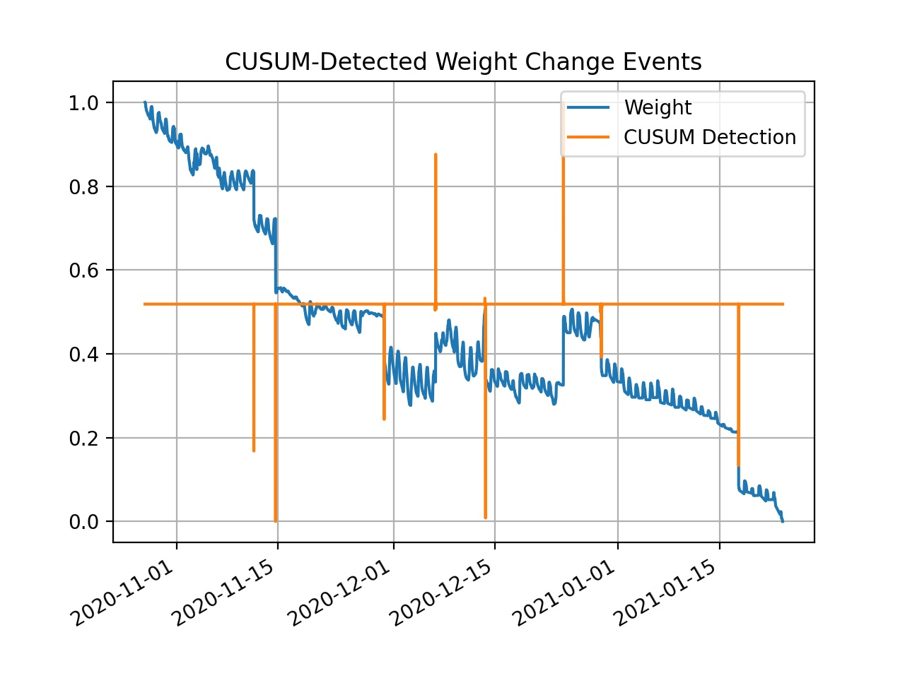

🐝  This is the second iteration of my beehive monitoring prototype.
Previous iteration <a href="hardware.html">here</a>, subsequent iteration <a href="hardware-v3.html">here</a>.

I've learned from my [previous prototype](hardware.html) that hive temperature readings taken right underneath the lid are not nearly as informative as they might seem. So maybe instead of the device living inside the hive lid, I should be taking readings near the bottom of the hive. And as long as I'm gonna be messing with the underside of the hive, I'd like to start taking some weight measurements. Weight increase can be good indicator of hive growth, as it means the bees are bringing in nectar and pollen. 

### Electronics ###

If this thing is going to run off of a battery, I'll have to use something that consumes much less power than a Raspberry Pi. I decided on an ESP32, which is an *awesome* SoC. I hooked it up to an analog microphone, 2 temperature sensors, a load cell amplifier, and a micro sd card adapter.

*The inside of the device.*

The whole thing is hooked up with DuPont wires. Not very nice to look at, but it does work. 

### Enclosure ###

The enclosure was really a way for me to explore some of Fusion 360's cooler features. It's made of four parts: a 3D-printed hexagonal box, a threaded pipe with an integrated screen that attaches to the bottom of the hive, a lid for the box, and a nut to hold the pipe in place. Here's how it attaches to the bottom board to get readings from internal hive conditions:

It's super cool that all these pieces can be 3D printed in-place and without support!
Here's the underside of the hive bottom board, with the prototype attached:

Inside of the rightmost support thing is a load cell mounted to pieces of aluminum angle bar, with some wood on the outside. The other side is just a 2x4 that has been ripped to an equal height. 

### Firmware ###

The hardware is only half the battle -- the next step is firmware. I'll spare you from reading the crappy code. Basically, the ESP32 has a little RTC that can be used as a wakeup alarm. Every 10 minutes, it wakes up from a deep-sleep mode, powers on all sensor peripherals, waits for readings to stabilize, writes the data onto the SD card, and then goes back to sleep. And every few wakeups, it will sync the past few readings with a server I have on my local network. Nothing fancy, just a Node.js script that writes the data into a database. I'll go into more detail on firmware design for the ESP32 in a later post.

### Data Analysis ###

This is one of those good news/bad news situations. The good? I was able to get great weight data and good audio. But I didn't notice a substantial difference in temperature readings between the inside and outside of the hive, even though I thought I properly insulated the inner sensor. 

This is further evidence to me that the best way to "take a beehive's temperature" is to measure from the **center of the broodnest.**  Bees require precise thermoregulation of their brood.  

Anyways, here's what the raw weight data looks like:

What the heck is going on here? I see small daily fluctuations as well as instantaneous "steps" in the signal (indicated by red arrows). These steps are caused by me screwing around with the hive; putting rocks on the hive lid to prevent raccoons or bears from getting in, adding/removing a roof for rain shielding, etc.

There are two questions I’d like to answer:
- Can I detect and filter out changes in weight due to human activity?
- Is the daily fluctuation caused only by bee activity? Or is there some other factor at play?

#### Detecting Instantaneous Change ####

The easiest way of detecting those steps in the signal is to look at the percent change between each data point and the subsequent one.

This could be good enough, but requires some manual thresholding. Moreover, if human activity results in a relatively small change in weight (like the point annoted with the red arrow) then the threshold would need to be really specific. 

An alternative route would be to use a more special-purpose algorithm for step detection, like [CUSUM](https://en.wikipedia.org/wiki/CUSUM). Here is a chart showing the detections with CUSUM (in orange) overlaid atop the raw weight signal:

The assumption here is that instantaneous changes in weight are likely due to human activity, while slower changes are likely due to bee activity (and other stuff, which we'll get into later). By doing this separation we can filter out the step functions in the data:

The cumulative loss in weight over this period of time is normal. During winter months, honey bees go into a sort of hibernation mode. They live off the honey stores they've collected during the year and generally reduce their energy expenditure. This isn't to say that they don't still fly around and collect resources during the winter; if conditions are right, they will. But because of a dearth in nectar supply and decreasing temperatures, a decrease in hive weight is to be expected. 

#### Causes of Daily Fluctuations ####

Speaking of temperature, I'm interested to know what is causing these daily fluctuations in weight. I suspect it is not just bees leaving the hive and returning. That may play a part, but I think other contributing causes may be related to temperature and/or humidity.  
