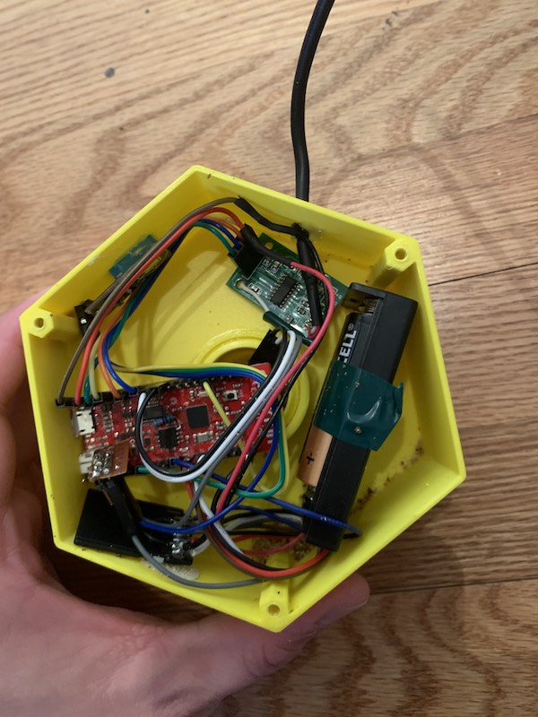
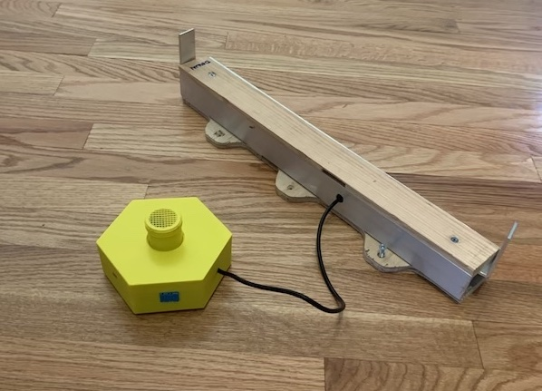

🐝  This is the second iteration of my beehive monitoring prototype.

I've learned from my previous prototype that hive temperature readings taken right underneath the lid are not nearly as informative as they might seem. So maybe instead of the device living inside the hive lid, I should be taking readings near the bottom of the hive. And as long as I'm gonna be messing with the underside of the hive, I'd like to start taking some weight measurements. Weight increase can be good indicator of hive growth, as it means the bees are bringing in nectar and pollen. 

If this thing is going to run off of a battery, I'll have to use something much lower-power than a Raspberry Pi. I'm using an ESP32, which is a super inexpensive SoC with all sorts of great features. I hooked it up to an analog microphone, 2 temperature sensors, a load cell amplifier, and a micro sd card adapter.

*The inside of the device.*

The whole thing is hooked up with DuPont wires. It's not very nice to look at, but it does work. 

### Enclosure ###

The enclosure was really a way for me to explore some of Fusion 360's cooler features. It's made of four parts: a 3D-printed hexagonal box, a threaded pipe with an integrated screen that attaches to the bottom of the hive, a lid for the box, and a nut to hold the pipe in place. 

*The device with the scale.*

### Firmware ###

The hardware is only half the battle -- the next step is writing firmware. I slapped together a little program for the ESP32 that would wake up, take sensor readings, sync with a server, and then go back to sleep. 

Looking at the preliminary data, I quickly realized this version was not going to work. The bees just don't thermoregulate the bottom of the hive. They are more interested in ensuring the brood chamber is thermoregulated. This meant that the form factor I had in mind was not going to work. So I decided to disassemble to prototype, lose the scale, and try putting the temperature sensor inside the hive. This ended up becoming my [third prototype](hardware-v3.html).
