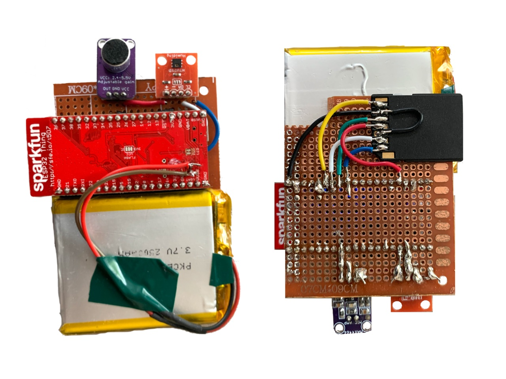
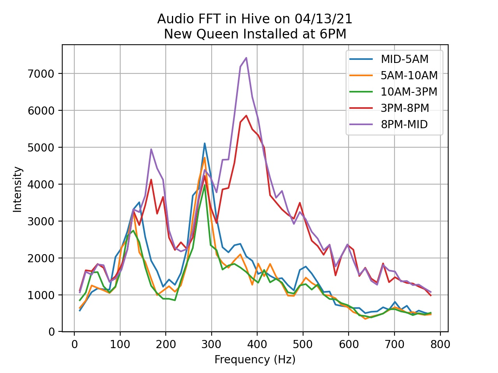

🐝  This is the third iteration of my beehive monitoring prototype.

I've learned from my previous prototypes ([v1](hardware.html), [v2](hardware-v2.html)) that hive temperature readings are most informative when they come directly from the brood chamber of the hive. So I made another one that can be placed **inside** the hive. 

#### ⚡️ Electronics

I'm using an ESP32, which is a super inexpensive SoC with all sorts of great features. I soldered it to a protoboard and hooked up an analog microphone and temperature sensor. 

The ESP32 is equipped with Wi-Fi and Bluetooth, so in theory I can just aggregate sensor readings in memory and send them off to a server. But I'd like to write the sensor readings to some kind of non-volatile memory for safekeeping. So I soldered on a MicroSD card adapter. Shield your eyes, this thing is kind of an abomination.

*The front and back of the prototype circuit.*

The ESP32 is a Sparkfun ESP32 Thing, which has a low-dropout voltage regulator on board. This means I can power it with a LiPo battery.

#### 📦 Enclosure

To prevent the bees from going nuts and tearing up the circuit, I modeled a little enclosure in Fusion 360. It's just a 3D-printed box that zip-ties to the frame. Because of the thickness of the circuit board, part of the frame had to be cut away. Not ideal, but we'll address that later.

*The enclosure, in place on the frame.*

#### Firmware

The firmware for this prototype is nearly the same as the firmware for [version 2](hardware-v2.html), so I won't really bore you with it. Basically a C++ program that orchestrates all the sensor readings and syncs. I will say that debugging the firmware was kind of a pain. You don't realize how many bugs your code has until it's literally surrounded by thousands of stinging insects. 

### Data Analysis ###

An interesting technical challenge with this version was audio processing. With my [very first prototype](hardware.html), I was recording lossless, hour-long WAV files. But with embedded hardware, there are power and memory limitations that necessitate a different approach. The ESP32 has 4 MB of memory – that’s a lot for an embedded device, but literally *three orders of magnitude less* than the Raspberry Pi I used in V1. 

For this one, I decided to record and average really short audio samples that could fit in memory, and process them on board the ESP32 with an FFT. (An FFT, and more generally a Fourier transform, is a method of converting signals into their component frequencies. For example, if you use an FFT on a choir singing a chord, you'll be able to tell the pitches the individual members were singing.) The resulting frequency information could then be saved onto the SD card and sent over Wi-Fi to my server.

With this prototype I wanted to dive deep into processing audio signals from within the hive. I installed this monitor in a hive without a queen. 

