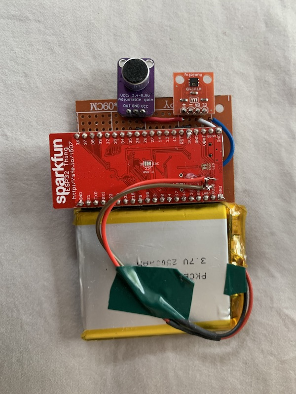
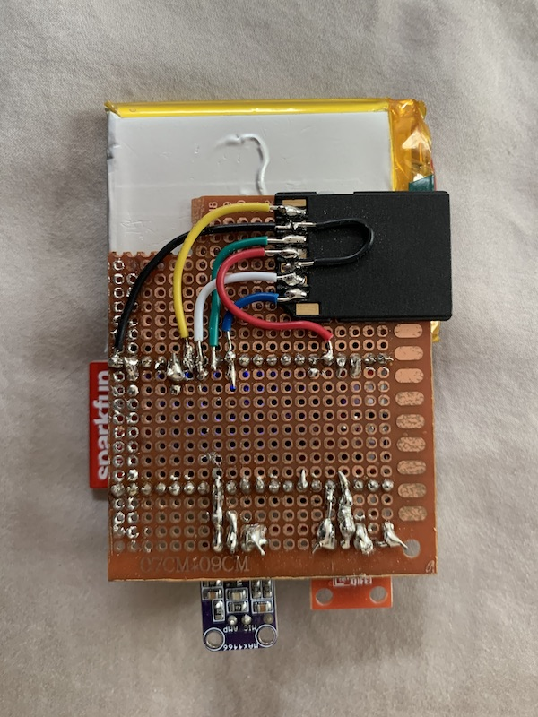
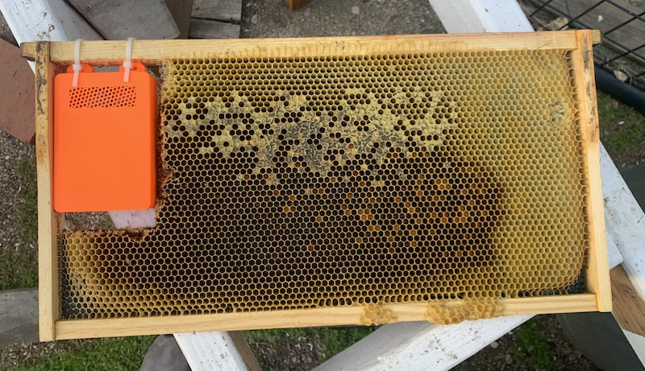

I've learned from my previous prototypes that hive temperature readings are most informative when they come directly from the brood chamber of the hive.

So I made another one that can be placed directly inside the hive. This means it needs to run off of a battery for months on end. I'm using an ESP32, which is a super inexpensive SoC with all sorts of great features. I soldered it to a protoboard and hooked up an analog microphone and temperature sensor. 

*The front of the prototype circuit/*

The ESP32 is equipped with Wi-Fi and Bluetooth, so in theory I can just aggregate sensor readings in memory and send them off to a server. But I'd like to write the sensor readings to some kind of non-volatile memory for safekeeping. So I soldered on a MicroSD card adapter. Shield your eyes, this thing is kind of an abomination.

*The back of the prototype circuit.*

The ESP32 is a Sparkfun ESP32 Thing, which has a low-dropout voltage regulator on board. This means I can power it with a LiPo battery.

#### Enclosure

To prevent the bees from going nuts and tearing up the circuit, I modeled a little enclosure in Fusion 360. It's just a 3D-printed box that zip-ties to the frame. Because of the thickness of the circuit board, part of the frame had to be cut away. Not ideal, but we'll address that later.

*The enclosure, in place on the frame.*

#### Firmware

The hardware is only half the battle -- the next step is writing firmware.
