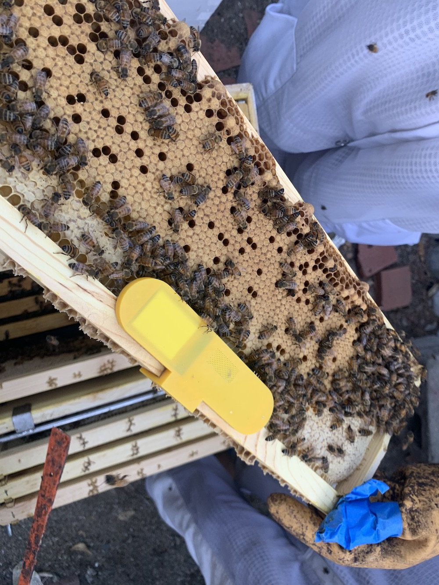
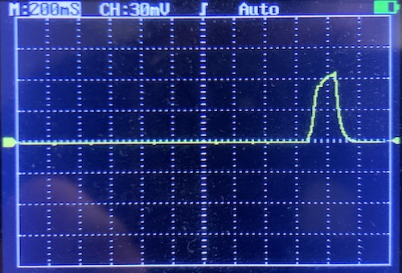

🐝  This is the fourth iteration of my beehive monitoring prototype.

I've learned from my previous prototypes ([v1](hardware.html), [v2](hardware-v2.html), [v3](hardware-v3.html)) that the ideal system for monitoring hive conditions would be small and battery operated so that it can be placed inside the hive. My [third prototype](hardware-v3.html) was the smallest yet, but required cutting away a secion of the bee's functional honeycomb. Moreover, I had to make them by hand, which doesn't scale very well. So for this version, I'm going to try and make a printed circuit board with the same functionality.

#### ⚡️ Electronics

The basic requirements for this thing are:
* An ESP32, which already has WiFi and Bluetooth built in
* a microphone
* a temperature and humidity sensor
* a method of storing large amounts of data

Based on my previous prototype, I drew up a circuit that seemed like it would work. Then I paid a guy on Fiverr to draw up a PCB to implement that schematic, then had them fabricated somewhere in China. Here's what the PCB looks like:

As you can see, there's a microphone, a temp/humidity sensor, and a micro-sd card slot. Initially, I was going to include a micro USB connector, but that would've complicated the circuit, and added cost. So instead I decided to use pogo pins on a 3d-printed jig to program the boards.

#### 📦 Enclosure

My previous design required that the honeycomb be cut away, but this one is thin enough that the PCB and battery can be slipped between the frames of the beehive. 
I modeled the enclosure in Fusion 360, then 3d printed it in yellow PLA.

#### Firmware

If you're not interested in software, feel free to skip this section. 
My prime objective with this version was to reduce power consumption.  I ended up spending a lot of time on this, primarily because the ESP32 is a power-hungry monster. Don't get me wrong, it's amazingly powerful and dirt cheap, but it's not well suited for low power battery-operated IoT devices. 

Some of the tricks I used to reduce power consumption:
* Using the deep sleep functionality of the ESP32, and using a hardware interrupt timer
* Re-compiling the bootloader to prevent checksumming the program memory on every wake
* Not syncing with WiFi on every wake
* Not writing to the SD card on every wake. Writing to disk is super slow, and there's a lot of overhead to mount the disk. I'm saving the sensor readings to RTC memory, and pooling disk writes. 
* Reducing the size of the audio buffer. This means the sound recording takes up less time (and makes the computation faster). The tradeoff is that you are effectively losing resolution in the output frequency domain (the frequency bin size is higher) but there's a happy medium.

After all those optimizations, I was able to get the average wake time to under 200mS, which for this hardware is pretty good! Here's the current on my oscilloscope.

Based on some experimentation and calculations, a 1000mAh battery would power this thing for 1.5 years! 

### Data Analysis ###

I'm still collecting data from these sensors, so I think I'll save the data analysis for another time. Stay tuned!

