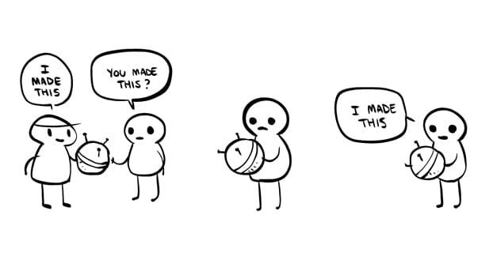

## What Is This?

This website is about beekeeping and computer science. If you're curious about this website's technical details, you can [read this post](about-this-site.html).

## What's the goal?

Making an affordable and open-source hive monitoring system using off-the-shelf components. 

## Who Made This?

I made this.

My name is **Josh Haug**, and I'm passionate about bees and computer science. My educational background:

* B.S. in Math / Computer Science from [Pepperdine](http://www.pepperdine.edu/)
* Pursing an M.S. in Computer Science from [USC](https://www.cs.usc.edu)

My beekeeping background:  

* Five hives in my backyard
* Stung more than 15 times

## Contact

If you'd like to contact me, there are a few ways of doing it:

* Send me an email at [josh.haug55@gmail.com](mailto:josh.haug55@gmail.com?Subject=Hello%20World)
* Check me out on [GitHub](https://www.github.com/joshhaug)
* Find me on [LinkedIn](https://www.linkedin.com/in/joshua-haug-64a04897)
